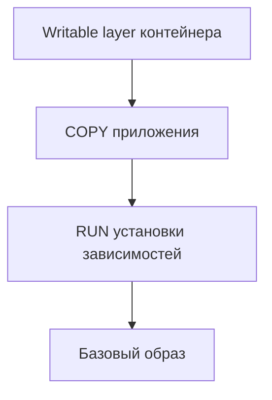

---
tags:
  - docker
  - devops
  - containers
topic: docker
subtopic: образы
status: готово
difficulty: начинающий
created: 2026-06-24
aliases:
  - Docker Images
  - Образы Docker
---

# 🖼️ Docker — Образы

> [!info] Навигация
> [[Docker MOC]] → [[Docker — Dockerfile]] → **Образы** → [[Docker — Контейнеры]]

---

## Что такое образ?

**Docker Image** — неизменяемый (immutable) шаблон файловой системы и метаданных, состоящий из набора слоёв (layers). Каждый слой содержит изменения относительно предыдущего слоя.



При запуске контейнера Docker добавляет поверх read-only слоёв образа отдельный
writable layer. Он относится к контейнеру, а не изменяет исходный образ.

Слои **переиспользуются** между образами → экономия дискового пространства.

---

## Именование образов

```
[registry/][namespace/]name[:tag][@digest]

docker.io/library/nginx:1.25          # Docker Hub, официальный
docker.io/myuser/myapp:latest         # Docker Hub, пользовательский
ghcr.io/org/repo:sha-abc123           # GitHub Container Registry
registry.example.com:5000/myapp:1.0   # приватный реестр
```

| Часть | Пример | По умолчанию |
|-------|--------|-------------|
| Registry | `docker.io` | Docker Hub |
| Namespace | `library` | Официальные образы |
| Name | `nginx` | — |
| Tag | `:latest` | `latest` |

---

## Основные команды

### Просмотр образов

```bash
docker images                     # список всех локальных образов
docker images -a                  # включая промежуточные слои
docker images nginx               # фильтр по имени
docker images --filter "dangling=true"   # образы без тега

docker image inspect nginx:latest          # подробная информация (JSON)
docker image history nginx:latest          # история слоёв
docker image ls --format "table {{.Repository}}\t{{.Tag}}\t{{.Size}}"
```

---

### Скачивание образов

```bash
docker pull nginx                  # latest тег
docker pull nginx:1.25-alpine
docker pull nginx@sha256:abc123    # по digest (гарантированная версия)

docker pull --platform linux/amd64 myimage  # конкретная платформа
```

---

### Сборка образов

```bash
docker build .                            # из Dockerfile в текущей папке
docker build -t myapp:1.0 .               # с тегом
docker build -t myapp:1.0 -f prod.Dockerfile .  # другой Dockerfile
docker build --no-cache .                 # без кэша слоёв
docker build --build-arg ENV=prod .       # передать ARG
docker build --target builder .           # multi-stage: остановиться на этапе

# BuildKit (рекомендуется — быстрее, умнее)
DOCKER_BUILDKIT=1 docker build .
docker buildx build \
  --platform linux/amd64,linux/arm64 \
  -t registry.example.com/myapp:1.0 \
  --push .
```

> [!info]
> В современных версиях Docker BuildKit обычно используется по умолчанию.
---

### Тегирование

```bash
docker tag myapp:1.0 myapp:latest
docker tag myapp:1.0 registry.example.com/myapp:1.0
docker tag nginx:latest myregistry.com/nginx:backup
```

---

### Публикация образов

```bash
docker login                                    # Docker Hub
docker login ghcr.io -u USERNAME                # GitHub CR
docker login registry.example.com              # приватный

docker push myuser/myapp:1.0
docker push ghcr.io/org/repo:latest
```

---

### Удаление образов

```bash
docker rmi nginx:latest                 # удалить образ
docker rmi -f nginx:latest              # принудительно
docker image rm myapp:1.0 myapp:2.0     # несколько сразу

# Очистка
docker image prune                      # удалить dangling образы
docker image prune -a                   # удалить все неиспользуемые
docker system prune                     # образы + контейнеры + сети
docker system prune -a --volumes        # + тома
```

---

### Экспорт / Импорт

```bash
# Образ → файл
docker save myapp:1.0 | gzip > myapp.tar.gz
docker save -o myapp.tar myapp:1.0

# Файл → образ
docker load < myapp.tar.gz
docker load -i myapp.tar

# ≠ docker export/import (работают с контейнерами, теряют историю)
```

---

## Реестры (Registries)

| Реестр | URL | Особенности |
|--------|-----|-------------|
| Docker Hub | `docker.io` | Публичные и приватные репозитории; лимиты зависят от текущего тарифа |
| GitHub CR | `ghcr.io` | Интеграция с GitHub Actions |
| AWS ECR | `*.ecr.amazonaws.com` | Интеграция с AWS |
| GCR / GAR | `gcr.io` / `*-docker.pkg.dev` | Google Cloud |
| Quay.io | `quay.io` | Red Hat |

### Запуск приватного реестра

```bash
docker run -d -p 5000:5000 --name registry registry:2
docker tag myapp localhost:5000/myapp:1.0
docker push localhost:5000/myapp:1.0
```

---

## Оптимизация размера образа

```bash
docker image history myapp:1.0   # посмотреть размер каждого слоя
docker inspect myapp:1.0 | jq '.[0].RootFS'  # слои образа
```

> [!tip] Стратегии уменьшения размера
> 1. Используй подходящий минимальный образ (`-slim`, Alpine, chiseled/distroless), предварительно проверив совместимость
> 2. Multi-stage builds — в финал попадает только runtime
> 3. Объединяй `RUN` команды и чисти кэш
> 4. `.dockerignore` — не включай лишнее в контекст
> 5. Экспериментальный `--squash` объединяет новые слои сборки, но обычно лучше оптимизировать Dockerfile и multi-stage build.

---

## 📎 Связанные заметки

```dataview
LIST
FROM #docker
WHERE file.name != this.file.name
SORT file.name ASC
```
