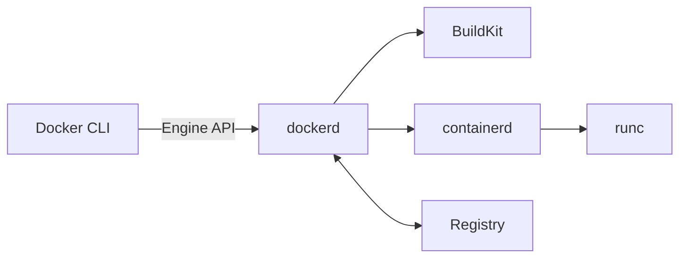
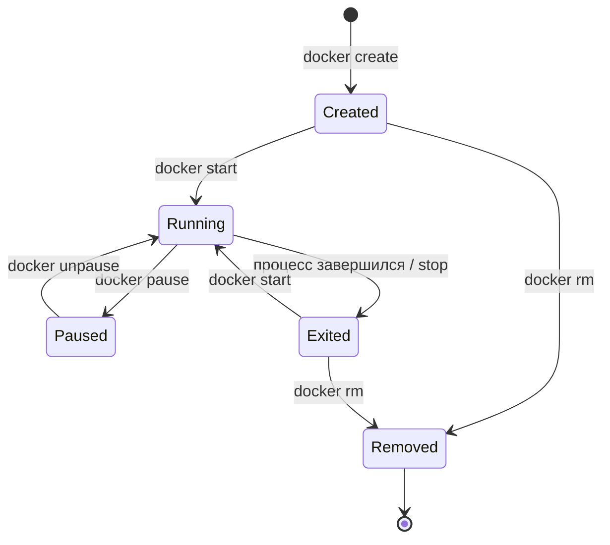

---
tags:
  - docker
  - devops
  - containers
topic: docker
subtopic: основы
status: готово
difficulty: начинающий
created: 2026-06-24
aliases:
  - Docker Basics
  - Основы Docker
---

# 🐳 Docker — Основы

> [!info] Навигация
> [[Docker MOC]] → **Основы** → [[Docker — Контейнеры]] → [[Docker — Образы]]

---

## Что такое Docker?

**Docker** — платформа контейнеризации для упаковки, доставки и запуска приложений в изолированных средах — **контейнерах**.

> [!quote] Ключевая идея
> Один и тот же образ можно воспроизводимо запускать в разных окружениях.
>
> Однако ОС и архитектура должны поддерживаться образом: Linux-контейнеру нужно
> Linux-ядро (Docker Desktop предоставляет его через VM), а для `amd64` и `arm64`
> могут потребоваться разные варианты образа.

---

## Docker vs Виртуальные машины

| Характеристика | 🐳 Docker | 💻 VM |
|---------------|-----------|-------|
| Запуск | Секунды | Минуты |
| Размер образа | МБ | ГБ |
| Изоляция | На уровне процесса | На уровне ОС |
| Потребление RAM | Низкое | Высокое |
| Ядро ОС | Общее с хостом | Отдельное |
| Переносимость | Высокая | Средняя |
| Use-case | Микросервисы, CI/CD | Полная изоляция ОС |

---

## Архитектура Docker



### Компоненты

| Компонент | Роль |
|-----------|------|
| **Docker Client** | CLI (`docker`) — отправляет команды демону |
| **Docker Daemon** (`dockerd`) | Основной процесс, управляет объектами Docker |
| **containerd** | Менеджер контейнеров. Управляет жизненным циклом контейнеров и вызывает OCI Runtime. |
| **runc** | OCI-совместимый runtime — непосредственно создаёт процессы |
| **Docker Registry** | Хранилище образов |

---

## Ключевые объекты Docker

### 🖼️ Image (Образ)
- Read-only шаблон для создания контейнеров
- Состоит из **слоёв (layers)** — каждый слой фиксирует изменения ФС
- Создаётся через [[Docker — Dockerfile]] или `docker commit`
- Подробнее: [[Docker — Образы]]

### 📦 Container (Контейнер)
- Запущенный (или остановленный) экземпляр образа
- Изолированный процесс с собственными namespace: pid, net, mnt, uts, ipc
- Поверх read-only слоёв образа добавляется **writable layer**
- Подробнее: [[Docker — Контейнеры]]

### 💾 Volume (Том)
- Механизм персистентного хранения данных вне контейнера
- Переживает пересоздание контейнера
- Подробнее: [[Docker — Тома (Volumes)]]

### 🌐 Network (Сеть)
- Виртуальная сеть для связи контейнеров между собой и с внешним миром
- Подробнее: [[Docker — Сеть]]

---

## Установка

```bash
# Linux: удобный скрипт для локального тестового окружения
curl -fsSL https://get.docker.com | sh
sudo usermod -aG docker $USER   # необязательно: запуск CLI без sudo

# Проверка
docker --version
docker info
docker run hello-world
```

> [!tip]
> После добавления в группу `docker` нужно перелогиниться или выполнить `newgrp docker`.
>
> [!warning] Важно о правах
> Членство в группе `docker` фактически даёт root-доступ к хосту. На сервере
> безопаснее использовать `sudo` только для нужных команд или настроить
> [[Docker — Пользователи и права#Rootless Docker|Rootless Docker]].
> Для production предпочтительна установка из официального репозитория вашего
> дистрибутива: так Docker будет получать обновления через пакетный менеджер.

---

## Жизненный цикл контейнера



> [!note]
> `docker run` — это сокращение для `docker create`, а затем `docker start`.
> Остановка не удаляет контейнер; удаление выполняется отдельно, если не задан
> `--rm`.

---

## 📎 Связанные заметки

```dataview
LIST
FROM #docker
WHERE file.name != this.file.name
SORT file.name ASC
```
