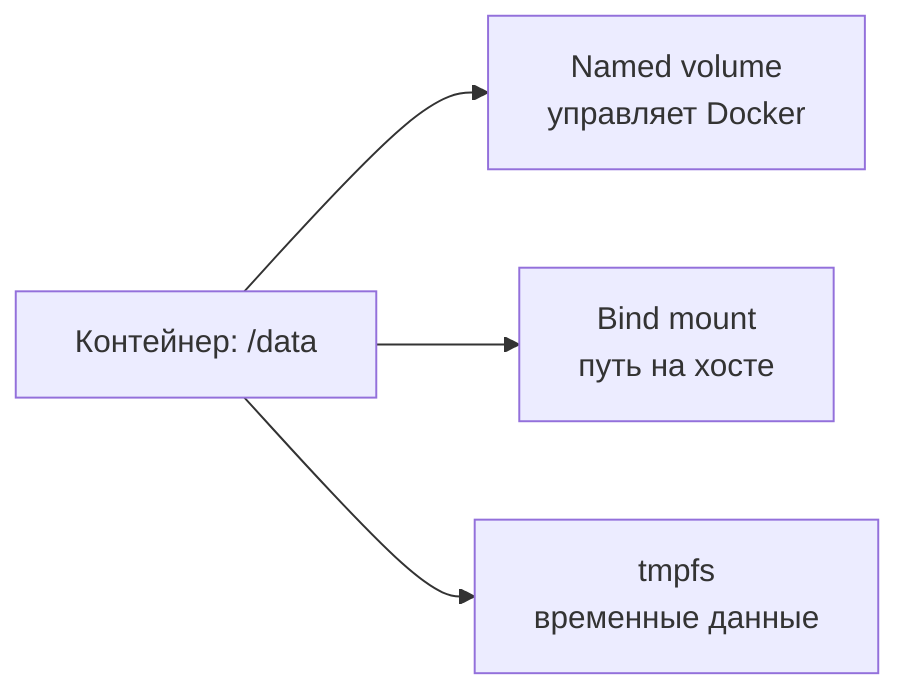

---
tags:
  - docker
  - devops
  - containers
topic: docker
subtopic: volumes
status: готово
difficulty: средний
created: 2026-06-24
aliases:
  - Docker Volumes
  - Docker Тома
  - Тома Docker
---

# 💾 Docker — Тома (Volumes)

> [!info] Навигация
> [[Docker MOC]] → [[Docker — Контейнеры]] → **Volumes** → [[Docker — Сеть]]

---

## Проблема

Данные, записанные в writable layer контейнера, сохраняются при `docker stop` и
повторном `docker start`, но исчезают при удалении контейнера (`docker rm`).
Хранить там важные данные неудобно: слой привязан к конкретному контейнеру и
не предназначен для резервного копирования или совместного использования.

**Решение** — монтирование томов / директорий хоста.

---

## Типы монтирования



---

## Сравнение типов

| | Named Volume | Bind Mount | tmpfs |
|-|-------------|------------|-------|
| Управление | Docker | ОС / пользователь | — |
| Расположение | `/var/lib/docker/volumes/` | Любая папка хоста | RAM |
| Портативность | ✅ Выше | ❌ Зависит от путей хоста | Не предназначен для переноса |
| Производительность | ✅ Высокая | Зависит от ОС | ✅ Очень высокая |
| Резервное копирование | Простое | Стандартные инструменты | ❌ Только в памяти |
| Use-case | БД, данные приложений | Dev-режим, конфиги | Временные файлы, кэш, чувствительные данные |

---

## Named Volumes — команды

```bash
# Создание
docker volume create myvolume
docker volume create --driver local myvolume
docker volume create   --driver local   --opt type=nfs   --opt o=addr=192.168.1.100,rw   --opt device=:/path/to/dir   nfs-volume

# Просмотр
docker volume ls
docker volume ls --filter "dangling=true"   # неиспользуемые тома
docker volume inspect myvolume              # подробности

# Использование
docker run -v myvolume:/data nginx
docker run --mount type=volume,src=myvolume,dst=/data nginx

# Удаление
docker volume rm myvolume
docker volume prune              # удалить все неиспользуемые тома
```

---

## Bind Mounts

```bash
# Старый синтаксис (-v)
docker run -v /host/path:/container/path nginx
docker run -v "$(pwd)/src:/app/src" myapp       # текущая папка

# Новый синтаксис (--mount) — более явный
docker run --mount type=bind,source=/host/path,target=/app nginx
docker run --mount type=bind,src="$(pwd)",dst=/app,readonly nginx

# Только для чтения
docker run -v /host/path:/container/path:ro nginx
```

> [!tip] Dev-режим
> Bind mount идеален для разработки — изменения в коде на хосте немедленно видны в контейнере.
>
> [!warning]
> Монтирование поверх непустого каталога скрывает находившиеся там файлы образа
> на время жизни контейнера. Кроме того, bind mount с правом записи позволяет
> процессу контейнера изменять файлы хоста.

---

## tmpfs

```bash
# Монтирование в RAM (данные не сохраняются)
docker run --tmpfs /tmp myapp
docker run --mount type=tmpfs,dst=/tmp,tmpfs-size=100m myapp
```

>[!info]
>Данные tmpfs исчезают после остановки или перезапуска контейнера. Это
>memory-backed файловая система, однако Linux может выгрузить её страницы в swap;
>поэтому tmpfs сам по себе не гарантирует, что секрет никогда не попадёт на диск.
---

## Резервное копирование томов

```bash
# Создать бэкап тома myvolume в текущую папку
docker run --rm \
  -v myvolume:/source:ro \
  -v "$(pwd):/backup" \
  alpine tar czf /backup/myvolume.tar.gz -C /source .

# Восстановить
docker run --rm \
  -v myvolume:/target \
  -v "$(pwd):/backup" \
  alpine tar xzf /backup/myvolume.tar.gz -C /target
```

> [!warning] Бэкап базы данных
> Копирование файлов работающей БД может дать несогласованный бэкап. Для
> PostgreSQL/MySQL обычно используй `pg_dump`/`mysqldump`, snapshot хранилища или
> останови запись на время файлового бэкапа.

---

## Volumes в Docker Compose

```yaml
services:
  db:
    image: postgres:16
    volumes:
      - pgdata:/var/lib/postgresql/data   # named volume
      - ./init.sql:/docker-entrypoint-initdb.d/init.sql  # bind mount

  app:
    image: myapp:latest
    volumes:
      - ./src:/app/src                    # bind mount (dev)
      - app-cache:/app/.cache             # named volume для кэша
      - type: tmpfs                       # tmpfs
        target: /tmp

volumes:
  pgdata:                     # Docker создаёт автоматически
  app-cache:
    driver: local
    driver_opts:
      type: none
      o: bind
      device: /custom/path
```

---

## Шаринг данных между контейнерами

```bash
# Оба контейнера подключают один и тот же named volume
docker run -d --name writer -v shared-data:/data my-writer
docker run -d --name reader -v shared-data:/data:ro my-reader
```

---

## Расположение данных

```bash
# Где хранится том на хосте
docker volume inspect myvolume | jq '.[0].Mountpoint'
# /var/lib/docker/volumes/myvolume/_data

# Посмотреть содержимое тома без контейнера
sudo ls /var/lib/docker/volumes/myvolume/_data
```

> [!note]
> Путь зависит от Docker data root и режима запуска. В Rootless Docker и Docker
> Desktop он будет другим; не работай с внутренним каталогом напрямую — используй
> контейнер, `docker volume inspect` и штатные средства резервного копирования.

---

## 📎 Связанные заметки

```dataview
LIST
FROM #docker
WHERE file.name != this.file.name
SORT file.name ASC
```
