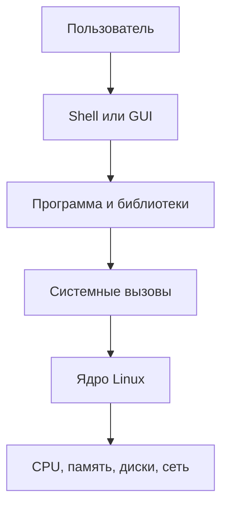

# Ориентация в Linux

Строго говоря, Linux — ядро: оно управляет памятью, процессором, устройствами и сетью. В быту «Linux» обычно означает дистрибутив: ядро плюс программы, менеджер пакетов и настройки. Ubuntu, Debian, Fedora и Arch отличаются деталями, но основные идеи общие.

Терминал запускает **оболочку** (shell), часто Bash. Shell читает команду, разворачивает переменные и запускает программу. Поэтому `cd` — встроенная команда: отдельная программа не смогла бы изменить каталог уже работающего shell.

## Узнать систему

```bash
uname -r                 # версия ядра
cat /etc/os-release      # дистрибутив и версия
whoami                   # текущий пользователь
pwd                      # текущий каталог
```

## Root и sudo

`root` — учётная запись с почти неограниченными правами. `sudo команда` запускает одну команду с повышенными правами, если политика системы это разрешает. Это не делает команду безопасной: наоборот, ошибка может затронуть всю систему.

Безопасный порядок: сначала посмотреть объект (`ls -ld <путь>` или `systemctl status <служба>`), затем сформулировать ожидаемый результат, выполнить узкую команду и проверить её эффект.

## Справка

```bash
man ls             # полная справочная страница
ls --help          # краткая справка
man 5 passwd       # формат файла /etc/passwd, раздел 5
apropos permissions # поиск по описаниям man-страниц
```

Номер раздела различает одноимённые сущности: `man 1 passwd` — команда, `man 5 passwd` — формат файла.

## Kernel space и user space

Ядро работает в привилегированном режиме, а обычные программы — в user space. Программа не читает диск и не создаёт процесс напрямую: она обращается к ядру через системные вызовы. Библиотеки и утилиты скрывают большую часть деталей.



Если команда вернула `Permission denied`, это часто результат проверки ядром credentials процесса и прав объекта, а не решение конкретной программы. Если процесс «завис», он может ждать устройство через ядро. Эта граница помогает выбирать инструмент диагностики.

## Из чего состоит дистрибутив

- ядро Linux;
- GNU coreutils и другие базовые утилиты;
- libc и системные библиотеки;
- init/service manager, часто systemd;
- менеджер пакетов и репозитории;
- установщик, конфигурация и политика обновлений;
- рабочее окружение, если это desktop-система.

Команды отличаются не только из-за «версии Linux». Например, сеть может настраиваться NetworkManager, systemd-networkd или netplan; firewall — nftables через разные оболочки; пакеты — apt, dnf или pacman. Сначала определяйте дистрибутив и компонент, затем выбирайте инструкцию.

## Архитектура и совместимость

```bash
uname -m
getconf LONG_BIT
file /bin/ls
```

`x86_64` и `aarch64` — разные архитектуры набора команд. Бинарный файл должен соответствовать архитектуре и доступным библиотекам. Скрипт более переносим, но также зависит от интерпретатора, утилит и их реализаций.

## Четыре вопроса перед неизвестной командой

1. Это встроенная команда, alias, функция или исполняемый файл? `type -a <команда>`.
2. От какого пользователя она выполнится? `id`.
3. Какой текущий каталог и какие пути затрагиваются? `pwd`, `ls -ld`.
4. Как проверить результат без изменения системы? `--help`, dry-run, вывод списка целей.

Дальше: [[02 — Терминал и базовые команды]].
