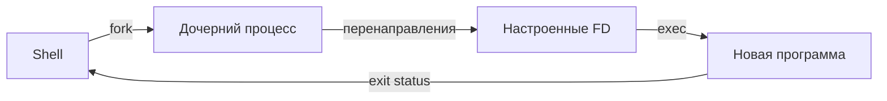

# Процессы и сигналы

Процесс — выполняющаяся программа с PID, памятью, открытыми файлами и учётными данными. Обычно он имеет родителя. PID 1 запускает и наблюдает за ключевыми процессами системы; на многих современных дистрибутивах это systemd.

```bash
ps aux
ps -o pid,ppid,user,stat,cmd -p <PID>
pgrep -a nginx
top                  # интерактивная сводка; q — выход
sleep 300 &          # фоновая задача текущего shell
jobs
fg %1
```

`jobs` видит задания текущего интерактивного shell; `ps` — процессы системы в пределах доступных вам прав.

## Сигналы

```bash
kill -TERM <PID>     # попросить штатно завершиться
kill -HUP <PID>      # часто «перечитать конфиг», но это решает программа
kill -KILL <PID>     # немедленное завершение ядром
```

`SIGKILL` нельзя обработать: процесс не успеет сохранить данные или корректно закрыть соединения. Начинайте с `TERM`, а `KILL` используйте только после диагностики. `kill` отправляет сигнал, а не обязательно «убивает».

В `ps` обычно: `R` — выполняется/готов, `S` — прерываемый сон, `D` — непрерываемое ожидание I/O, `T` — остановлен, `Z` — zombie. Zombie уже завершён; его статус не забрал родитель. Убить zombie нельзя — нужно разбираться с родителем.

## Как появляется процесс

Классическая Unix-модель: процесс создаёт потомка через `fork`, после чего потомок часто вызывает `execve` и заменяет свою программу другой. PID при успешном `exec` сохраняется, но код, данные и стек заменяются. Shell использует эту модель для запуска внешней команды.



Builtin-команды вроде `cd` выполняются самим shell, потому что изменение каталога дочернего процесса не изменило бы каталог родителя.

## Процесс и поток

Процесс владеет виртуальным адресным пространством и ресурсами. Потоки одного процесса разделяют память и многие ресурсы, но планируются ядром отдельно. В Linux каждый поток имеет task ID; `ps -L -p <PID>` показывает потоки. Высокая загрузка одного потока может выглядеть как примерно 100% одного CPU, даже на многоядерной машине.

## /proc/PID

```bash
cat /proc/<PID>/status
tr '\0' ' ' < /proc/<PID>/cmdline
readlink /proc/<PID>/exe
readlink /proc/<PID>/cwd
ls -l /proc/<PID>/fd
cat /proc/<PID>/limits
```

Доступ к части файлов ограничен. PID может быстро переиспользоваться после завершения процесса, поэтому в автоматизации одного числа PID иногда недостаточно для доказательства идентичности процесса.

## Родители, сироты и zombie

Родитель получает код завершения потомка через `wait`. Пока он его не забрал, остаётся zombie — запись в таблице процессов без исполняемого кода. Сирота переподчиняется PID 1 или subreaper. Множество zombie обычно означает ошибку родительской программы.

## Сигналы подробнее

```bash
kill -l
pkill -TERM -x nginx
pgrep -a -x nginx
```

Имя-сигнал имеет более ясный смысл, чем номер. `SIGHUP` не гарантирует reload: действие определяет приложение. `SIGSTOP` и `SIGKILL` нельзя перехватить; остальные могут иметь обработчик. Перед `pkill` сначала выполните соответствующий `pgrep` с теми же критериями.

## Приоритет и планирование

```bash
ps -o pid,ni,pri,stat,pcpu,cmd -p <PID>
nice -n 10 long-command
renice 10 -p <PID>
```

Nice влияет на относительную долю CPU для обычной политики планирования; большее значение — ниже приоритет. Это не лимит CPU и не исправляет I/O-зависание. Повышение приоритета (уменьшение nice) обычно требует привилегий.

## Foreground process group и терминал

Конвейер может содержать несколько процессов, но терминал назначает foreground-группу. Поэтому `Ctrl+C` обычно посылается всем участникам foreground-конвейера, а не одному случайному PID. Shell ждёт завершения группы и собирает статусы.

## Базовая диагностика процесса

```bash
ps -o pid,ppid,user,stat,etime,%cpu,%mem,wchan:24,cmd -p <PID>
lsof -p <PID>
strace -p <PID>           # если установлен и разрешено; заметно влияет на процесс
```

Сначала смотрите состояние, время работы, CPU/RAM, родителя и журнал приложения. `strace` подключайте позже: он показывает системные вызовы, требует прав и может замедлить нагруженный процесс.

## Программа и процесс

Программа — файл с инструкциями, например `/usr/bin/sleep`. Процесс — конкретный запущенный экземпляр. Один файл браузера может породить десятки процессов; один процесс существует только во время выполнения.

У процесса есть:

- PID и PPID;
- пользователь и группы;
- виртуальная память;
- текущий каталог и корень;
- открытые файловые дескрипторы;
- переменные окружения;
- обработчики сигналов;
- потоки и состояние планирования.

## Наблюдаем запуск

```bash
sleep 300 &
pid=$!
printf 'PID=%s\n' "$pid"
ps -o pid,ppid,user,stat,etime,cmd -p "$pid"
readlink "/proc/$pid/exe"
readlink "/proc/$pid/cwd"
tr '\0' '\n' < "/proc/$pid/environ" | head
kill -TERM "$pid"
wait "$pid"
printf 'status=%s\n' "$?"
```

`$!` — PID последнего фонового процесса текущего shell. `wait` просит shell дождаться потомка и получить его код завершения. После завершения каталог `/proc/PID` исчезает.

## Почему ps и top показывают разное

`ps` — снимок. `top` периодически пересчитывает изменение показателей. CPU является скоростью использования за интервал, память — состоянием на момент измерения. Короткий процесс может не попасть ни в один снимок.

`%CPU` зависит от формата и инструмента. В `top` процесс с одним полностью занятым потоком часто показывает около 100%, а многопоточный — больше 100% на многоядерной системе. Смотрите количество CPU и настройки режима отображения.

## Состояния простыми словами

- `R`: процесс сейчас исполняется на CPU либо стоит в очереди на CPU;
- `S`: спит и может быть разбужен событием/сигналом;
- `D`: ждёт kernel I/O в непрерываемом состоянии; SIGKILL подействует после выхода из этого состояния;
- `T`: остановлен сигналом или отладчиком;
- `Z`: уже завершился, но родитель не забрал статус.

Буквы могут иметь дополнительные модификаторы (`+`, `s`, `<`, `N`). Используйте `man ps`, раздел PROCESS STATE CODES.

## Сигнал не содержит сложную команду

Сигнал несёт номер и небольшую метаинформацию. Значение определяет программа. Например, Nginx обрабатывает HUP как reload, но другая программа может завершиться. Правильный способ управления системной службой — обычно `systemctl reload`, потому что unit знает основной процесс и поддерживаемую операцию.

## TERM против KILL — сценарий

1. Убедитесь, что PID относится к нужному процессу: `ps -fp PID`.
2. Отправьте `SIGTERM`.
3. Дайте приложению разумное время на завершение.
4. Посмотрите журнал и дочерние процессы.
5. Только если процесс не выходит и последствия понятны, используйте `SIGKILL`.

Не посылайте сигналы случайным совпадениям имени. `pkill java` может затронуть несколько приложений; systemd/cgroup обычно точнее определяют службу.

## Почему процессы остаются после закрытия терминала

При закрытии терминала kernel сообщает о hangup; shell и задачи могут получить SIGHUP. `nohup` меняет обработку и перенаправляет вывод, но не обеспечивает рестарты, лимиты, журналирование и зависимости. Для постоянного процесса создавайте systemd service.

## Упражнения

1. Запустите два `sleep` и найдите только их через `pgrep -a -x sleep`.
2. Остановите один через `kill -STOP`, проверьте `STAT`, продолжите `CONT`.
3. Посмотрите его PPID и найдите родителя.
4. Откройте `/proc/PID/fd`, объясните дескрипторы 0, 1, 2.
5. Завершите оба через TERM и проверьте, что PID исчезли.

Дальше: [[06 — Сервисы и журналы]].
