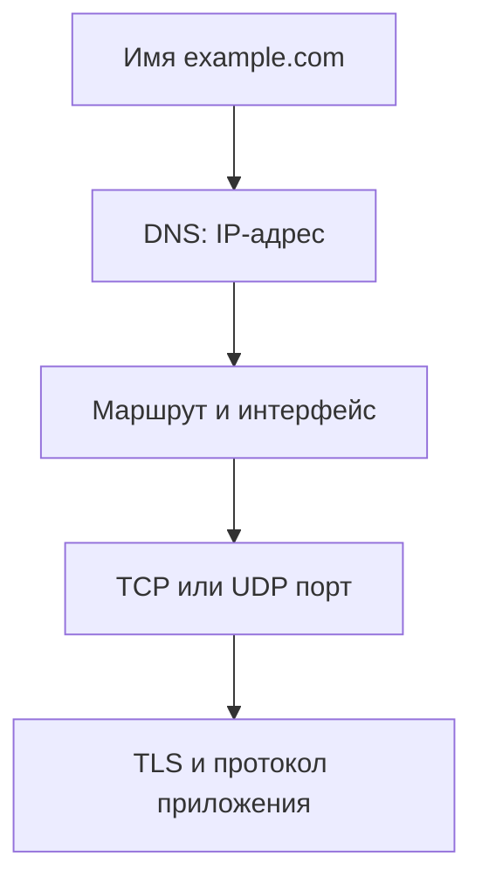

# Сеть, диски и практика

IP-адрес определяет узел, порт — приложение на нём, DNS сопоставляет имя с адресом. `127.0.0.1` и `::1` доступны только с текущей машины; `0.0.0.0` в выводе службы обычно означает прослушивание всех IPv4-интерфейсов.

```bash
ip addr
ip route
ss -tulpn
getent hosts example.com
ping -c 4 1.1.1.1
curl -I https://example.com
ssh user@server.example
ssh-keygen -t ed25519 -C 'my-laptop'
```

`ping` проверяет ICMP-достижимость, но не доказывает, что сайт или порт работают. При первом SSH-подключении сверяйте отпечаток ключа сервера через доверенный канал. Не отправляйте приватный ключ в чат, репозиторий или на сервер.

## Диски и монтирование

Диск — устройство (`/dev/sda`), раздел — его часть, файловая система — способ хранить файлы, монтирование — подключение её к каталогу.

```bash
lsblk -f
findmnt
df -hT
sudo mount /dev/sdb1 /mnt/data
sudo umount /mnt/data
sudo blkid /dev/sdb1
```

Перед `mount`, `mkfs`, `fdisk` или работой с разделами несколько раз сверьте устройство через `lsblk -f`. `mkfs` создаёт файловую систему и уничтожает прежние данные на выбранной цели. Для постоянного монтирования в `/etc/fstab` используйте UUID и после изменения проверяйте `sudo mount -a` до перезагрузки.

## Мини-лаборатория

```bash
mkdir -p ~/linux-lab/{inbox,archive}
printf 'first\nsecond\nerror: example\n' > ~/linux-lab/inbox/app.log
grep -n 'error' ~/linux-lab/inbox/app.log
wc -l ~/linux-lab/inbox/app.log
cp ~/linux-lab/inbox/app.log ~/linux-lab/archive/
stat ~/linux-lab/archive/app.log
```

Затем запустите `sleep 120 &`, найдите его через `jobs` и `ps`, завершите `kill -TERM`. Посмотрите `journalctl -b`, `df -hT` и `findmnt`, ничего не меняя. Так вы закрепите связи между shell, процессами, журналом и файловой системой.

## Сетевая модель для диагностики



Проверяйте слои по порядку:

```bash
getent ahosts example.com
ip route get 1.1.1.1
ss -lntp
nc -vz example.com 443       # если netcat установлен
curl -v https://example.com/
```

Успешный DNS не доказывает доступность порта. Успешное TCP-соединение не доказывает корректность TLS или HTTP. `ping` может блокироваться firewall даже при работающем сервисе.

## Адрес прослушивания

Сервис на `127.0.0.1:8080` доступен только локально. На `0.0.0.0:8080` он принимает IPv4-соединения на всех подходящих интерфейсах, но внешний доступ ещё зависит от маршрутизации, host/cloud firewall и NAT. Для IPv6 отдельно проверяйте `::` и настройки dual-stack.

```bash
ss -lnt '( sport = :8080 )'
curl -v http://127.0.0.1:8080/
```

## DNS и hosts

`getent hosts` использует настроенный Name Service Switch и учитывает `/etc/hosts`; `dig` запрашивает DNS и полезен для подробной диагностики, но может показать не тот путь разрешения, который использует приложение.

```bash
getent hosts server.local
resolvectl status            # в системах с systemd-resolved
dig +short example.com       # если dnsutils/bind-utils установлен
```

## SSH: ключи и конфигурация

```sshconfig
Host dev-server
    HostName 192.0.2.10
    User alice
    IdentityFile ~/.ssh/id_ed25519_dev
```

```bash
chmod 700 ~/.ssh
chmod 600 ~/.ssh/config ~/.ssh/id_ed25519_dev
ssh -v dev-server
```

Опция `-v` объясняет выбор конфигурации, ключей и этап соединения. Не удаляйте запись `known_hosts` только потому, что ключ изменился: сначала выясните причину и сверьте новый отпечаток.

## Устройство, раздел, ФС и mount — разные уровни

| Уровень | Пример | Назначение |
| --- | --- | --- |
| устройство | `/dev/nvme0n1` | весь накопитель |
| раздел | `/dev/nvme0n1p2` | диапазон блоков |
| слой | LUKS, LVM, RAID | шифрование/тома/отказоустойчивость |
| файловая система | ext4, XFS, Btrfs | файлы и каталоги |
| точка монтирования | `/home` | место в дереве `/` |

`lsblk -f` показывает связь, но перед разрушительными действиями также сверяйте размер, модель и mountpoints. Имена `/dev/sdX` не являются постоянными; UUID файловой системы удобнее для `fstab`.

## /etc/fstab

Поля: источник, точка, тип, опции, dump, порядок fsck.

```fstab
UUID=<uuid> /srv/data ext4 defaults,nofail 0 2
```

`nofail` меняет поведение загрузки при отсутствии устройства и не всегда желателен для критичных данных. Создайте точку монтирования, сделайте копию `fstab`, проверьте `findmnt --verify` (если поддерживается) и `mount -a`. Не используйте пример UUID буквально.

## Свободное место не равно размеру файлов

`df` отвечает о блоках файловой системы, `du` — о достижимых файлах. Кроме удалённых открытых файлов, расхождения вызывают snapshots, reserved blocks, sparse files, bind mounts и разные файловые системы. Для sparse-файла `ls -lh` показывает логический размер, а `du -h` — реально выделенные блоки.

## Чек-лист

- Регулярно обновляйте систему из доверенных репозиториев.
- Делайте и проверяйте резервные копии.
- Используйте обычную учётную запись и точечный `sudo`.
- Не кладите секреты в историю shell и командную строку.
- Перед рекурсивным удалением или работой с диском проверяйте цель дважды.
- Не открывайте сетевой порт наружу до настройки аутентификации и firewall.
- Перед изменением SSH/firewall на удалённой машине оставляйте вторую проверенную сессию.

## Сеть: от приложения к пакету

Когда `curl https://example.com` обращается к сайту, упрощённо происходят шаги:

1. имя преобразуется в IPv4/IPv6-адрес;
2. таблица маршрутизации выбирает интерфейс и next hop;
3. для TCP создаётся соединение с портом 443;
4. TLS проверяет сертификат и согласует шифрование;
5. HTTP отправляет запрос и получает ответ.

Ошибка на каждом слое звучит по-разному: DNS failure, network unreachable, connection refused, timeout, certificate error, HTTP 404/500. Не лечите их одной командой «перезапустить сеть».

## Интерфейс и адрес

```bash
ip -br link
ip -br addr
ip route
ip route get 8.8.8.8
```

Интерфейс может быть физическим (`enp...`, `wlp...`), loopback (`lo`), bridge или виртуальной парой контейнера. Флаг `UP` означает административное включение, но не гарантирует связь. CIDR `/24` у IPv4 описывает длину сетевой части, а не номер порта.

## Порт и сокет

Сокет TCP обычно определяется протоколом, локальным адресом/портом и удалённым адресом/портом. Сервер слушает, клиент инициирует соединение.

```bash
ss -lnt
ss -tn state established
ss -lntp 'sport = :22'
```

`Connection refused` обычно означает, что узел достижим, но на адресе/порту никто не слушает либо firewall активно отверг соединение. Timeout чаще указывает на фильтрацию, маршрут или отсутствие ответа, но это не абсолютное правило.

## SSH по шагам

1. Клиент соединяется с сервером.
2. Сервер доказывает идентичность host key; клиент сверяет `known_hosts`.
3. Пользователь доказывает право входа паролем, ключом или другим методом.
4. Сервер создаёт сессию и запускает shell/команду.

Публичный ключ можно копировать на сервер, приватный остаётся у владельца. Passphrase защищает приватный ключ при краже файла; ssh-agent временно хранит разблокированный ключ.

```bash
ssh-keygen -lf ~/.ssh/id_ed25519.pub
ssh-add -l
ssh -vv dev-server
```

`-vv` может раскрыть имена пользователей, хостов и пути; очищайте вывод перед публикацией.

## Диски: почему уровни важны

Допустим, `lsblk` показывает диск, LUKS-устройство, LVM logical volume и ext4. Форматирование неправильного уровня уничтожит структуру над ним. Сначала нарисуйте цепочку «физический диск → раздел → шифрование → том → ФС → mountpoint».

```bash
lsblk -o NAME,TYPE,SIZE,FSTYPE,FSVER,LABEL,UUID,MOUNTPOINTS
findmnt -o TARGET,SOURCE,FSTYPE,OPTIONS
```

Не копируйте `/dev/sda` из чужой инструкции: на вашей машине это может быть системный диск, а нужное устройство называться иначе.

## Mount временно и постоянно

`mount` меняет текущее дерево до размонтирования/reboot. Запись в `fstab` описывает желаемое постоянное монтирование. Точка должна существовать; её прежнее содержимое временно скрывается.

```bash
findmnt -T /home
mountpoint /home
findmnt --verify             # проверяет fstab, если поддерживается
```

При ошибке в `fstab` система может перейти в emergency mode. На удалённом сервере нужна console/recovery возможность.

## Файловая система заполнена: порядок

```bash
df -hT
df -ih
du -xhd1 /var 2>/dev/null | sort -h
sudo lsof +L1
```

Сначала определите конкретную ФС. Затем проверьте блоки и inode. Ограничение `-x` не переходит на другие ФС. Не удаляйте журналы/данные БД вручную: используйте ротацию, штатную очистку или остановку/backup по документации приложения.

## Упражнения

1. Определите адрес loopback и default route.
2. Для локальной службы найдите адрес bind и PID через `ss`.
3. Сравните `getent hosts` и `dig` для одного имени.
4. Постройте таблицу устройств своей машины только командами чтения.
5. Для `$HOME` определите source, FSTYPE и mount options.

Вернуться: [[Linux MOC]].
