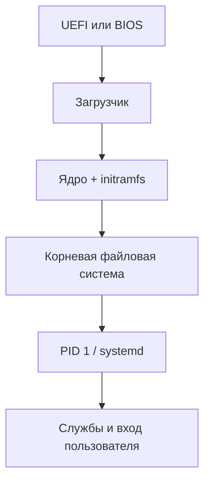

# Загрузка Linux и ядро

Упрощённая последовательность:



1. Firmware инициализирует оборудование и выбирает загрузочную запись.
2. Загрузчик (часто GRUB) загружает kernel и initramfs.
3. Ядро настраивает память, планировщик и драйверы; initramfs содержит минимальную среду для доступа к настоящему корню, например при шифровании или LVM.
4. Ядро запускает процесс init с PID 1.
5. systemd достигает выбранной target и запускает зависимости.

## Диагностика загрузки

```bash
journalctl -b             # текущая загрузка
journalctl -b -1          # предыдущая, если журнал сохранился
journalctl -k -b          # сообщения ядра текущей загрузки
systemd-analyze time
systemd-analyze critical-chain
systemctl --failed
```

`systemd-analyze blame` показывает длительность активации юнитов, но не всегда виновника общей задержки: службы запускаются параллельно и могут ждать внешние события. Для порядка зависимостей полезнее `critical-chain`.

## Ядро и модули

```bash
uname -r
lsmod | less
modinfo <module>
lspci -k
lsusb
```

Модуль — загружаемая часть ядра, часто драйвер. `modprobe` загружает модуль вместе с зависимостями; его удаление может отключить устройство или сеть. Не используйте `rmmod`/`modprobe -r` на рабочей машине без плана восстановления.

## Targets и режим восстановления

Targets группируют состояние системы. `multi-user.target` обычно означает многопользовательский текстовый режим, `graphical.target` добавляет графический вход, `rescue.target` предназначен для восстановления. Не переключайте target удалённо, пока не понимаете, сохранится ли сеть и SSH.

Изменение параметров kernel в строке загрузки, initramfs или загрузчике относится уже к администрированию: заранее делайте копию конфигурации и сохраняйте возможность выбрать старое ядро.
