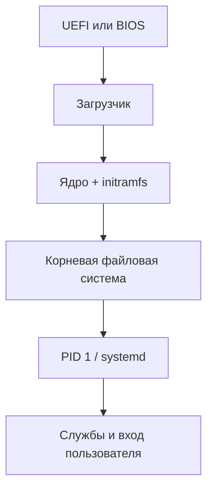

# Загрузка Linux и ядро

Упрощённая последовательность:



1. Firmware инициализирует оборудование и выбирает загрузочную запись.
2. Загрузчик (часто GRUB) загружает kernel и initramfs.
3. Ядро настраивает память, планировщик и драйверы; initramfs содержит минимальную среду для доступа к настоящему корню, например при шифровании или LVM.
4. Ядро запускает процесс init с PID 1.
5. systemd достигает выбранной target и запускает зависимости.

## Диагностика загрузки

```bash
journalctl -b             # текущая загрузка
journalctl -b -1          # предыдущая, если журнал сохранился
journalctl -k -b          # сообщения ядра текущей загрузки
systemd-analyze time
systemd-analyze critical-chain
systemctl --failed
```

`systemd-analyze blame` показывает длительность активации юнитов, но не всегда виновника общей задержки: службы запускаются параллельно и могут ждать внешние события. Для порядка зависимостей полезнее `critical-chain`.

## Ядро и модули

```bash
uname -r
lsmod | less
modinfo <module>
lspci -k
lsusb
```

Модуль — загружаемая часть ядра, часто драйвер. `modprobe` загружает модуль вместе с зависимостями; его удаление может отключить устройство или сеть. Не используйте `rmmod`/`modprobe -r` на рабочей машине без плана восстановления.

## Targets и режим восстановления

Targets группируют состояние системы. `multi-user.target` обычно означает многопользовательский текстовый режим, `graphical.target` добавляет графический вход, `rescue.target` предназначен для восстановления. Не переключайте target удалённо, пока не понимаете, сохранится ли сеть и SSH.

Изменение параметров kernel в строке загрузки, initramfs или загрузчике относится уже к администрированию: заранее делайте копию конфигурации и сохраняйте возможность выбрать старое ядро.

## Этапы загрузки подробнее

### 1. Firmware

UEFI/BIOS выполняет первичную инициализацию и выбирает загрузочную запись. UEFI обычно читает загрузчик с EFI System Partition. Secure Boot проверяет доверенную цепочку подписей, но детали зависят от дистрибутива и firmware.

### 2. Загрузчик

GRUB или другой загрузчик выбирает kernel, передаёт параметры командной строки и загружает initramfs. Меню может позволить выбрать прежнее ядро или recovery mode.

### 3. Kernel и initramfs

Kernel ещё не обязательно умеет открыть настоящий root: драйвер диска, LUKS, RAID или LVM могут находиться в initramfs. Минимальная среда обнаруживает устройства, собирает слои хранения и передаёт управление настоящему root.

### 4. PID 1

После монтирования root kernel запускает init. Systemd читает units, строит транзакцию зависимостей и параллельно активирует устройства, mounts, sockets и services.

## Командная строка ядра

```bash
cat /proc/cmdline
```

Там могут быть параметры root, quiet/splash, console, cgroups и драйверов. Не меняйте их по случайному совету: ошибка в `root=`, storage или console может помешать загрузке.

## dmesg и journalctl -k

`dmesg` читает kernel ring buffer; доступ может быть ограничен. `journalctl -k -b` показывает kernel-сообщения, сохранённые journald для выбранной загрузки.

```bash
journalctl --list-boots
journalctl -k -b 0
journalctl -k -b -1
```

Смотрите временную последовательность. Строка с `error` не всегда критична: драйвер может попробовать один режим, получить отказ и успешно перейти к другому.

## Модули и встроенные драйверы

Драйвер может быть встроен в kernel или загружен модулем `.ko`. Если `lsmod` не показывает драйвер, это не доказывает его отсутствия — он может быть встроен.

```bash
modinfo -F filename <module>
modinfo -F depends <module>
cat /proc/modules | head
```

Параметры модулей можно передавать при загрузке или через конфигурацию modprobe. Их смысл сверяйте с документацией kernel/драйвера.

## Что проверять после неудачной загрузки

- появилось ли устройство хранения;
- найден ли правильный root UUID;
- открылась ли LUKS/LVM/RAID цепочка;
- смонтировался ли root read-write;
- запустился ли PID 1;
- какие units failed;
- началась ли проблема после kernel/package/config update.

## Безопасная практика

Только прочитайте `/proc/cmdline`, список загрузок, kernel journal, `systemctl --failed` и `systemd-analyze critical-chain`. Нарисуйте последовательность вашей загрузки. Не меняйте GRUB, initramfs или модули в первой лаборатории.
