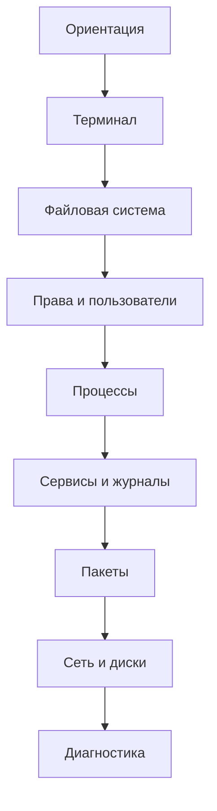

# Linux — основы

Это учебная база для человека, который умеет открыть терминал, но хочет понимать, что происходит между вводом команды и результатом. Первый проход делайте по основному маршруту, затем переходите к углубляющим заметкам и лабораторным работам.



## Маршрут

1. [[01 — Ориентация в Linux]] — дистрибутив, ядро, shell, root.
2. [[02 — Терминал и базовые команды]] — пути, файлы, поиск, ввод и вывод.
3. [[03 — Файловая система]] — каталог `/`, ссылки, `/proc`.
4. [[04 — Пользователи и права]] — владелец, группы, `rwx`, `sudo`.
5. [[05 — Процессы и сигналы]] — PID, состояния, фоновые задачи.
6. [[06 — Сервисы и журналы]] — systemd, `systemctl`, `journalctl`.
7. [[07 — Пакеты и обновления]] — репозитории и обновления.
8. [[08 — Сеть, диски и практика]] — IP, DNS, SSH, устройства и монтирование.
9. [[09 — Bash подробнее]] — разбор команды, кавычки, переменные, коды выхода и функции.
10. [[10 — Работа с текстом и архивами]] — `grep`, `sed`, `awk`, сортировка, `tar` и сжатие.
11. [[11 — Окружение и конфигурация shell]] — переменные среды, `PATH`, профили и история.
12. [[12 — Память и ресурсы]] — RAM, swap, load average, CPU и открытые файлы.
13. [[13 — Загрузка Linux и ядро]] — firmware, загрузчик, kernel, initramfs и systemd targets.
14. [[14 — Планирование задач]] — cron, systemd timers и одноразовый запуск.
15. [[15 — Диагностика и лабораторные работы]] — алгоритм поиска проблемы и задания.
16. [[16 — Глоссарий Linux]] — краткие определения терминов, встречающихся в базе.

## Формат учебных заметок

Материал специально повторяет ключевые идеи под разными углами. Для первого прохода:

1. прочитайте простое объяснение;
2. вручную наберите безопасные команды без `sudo`;
3. перед Enter предскажите результат;
4. сравните прогноз с выводом;
5. выполните упражнения;
6. запишите незнакомые слова и найдите их в [[16 — Глоссарий Linux]].

Команды не нужно заучивать целиком. Важно понимать объект действия, пользователя, путь, источник данных и способ проверить результат.

## Что считать освоением темы

Не пытайтесь запомнить все флаги. После каждой заметки вы должны уметь:

1. объяснить модель своими словами;
2. найти нужную команду через `man` или `--help`;
3. выполнить безопасное упражнение без `sudo`;
4. понять, какие данные собрать, если команда не сработала.

Связь с Docker: контейнер не отменяет Linux. Его процессы, пользователи, файловые дескрипторы, сеть и точки монтирования используют те же механизмы ядра, только в изолированных пространствах имён и cgroups.

## Автоматический список заметок

Следующий запрос требует плагин Dataview. Ручной маршрут выше остаётся рабочим без плагинов.

```dataview
TABLE WITHOUT ID
  file.link AS "Тема",
  order AS "Порядок",
  join(tags, ", ") AS "Теги"
FROM "linux-basics"
WHERE order
SORT order ASC
```

Если каталог в вашем vault называется иначе, замените `"linux-basics"` на его путь. Поле `order` хранится в YAML frontmatter каждой учебной заметки.

## Быстрый поиск по разделам

```dataview
LIST
FROM #linux
WHERE contains(tags, "security") OR contains(tags, "troubleshooting")
SORT file.name ASC
```

Этот запрос собирает заметки по безопасности и диагностике независимо от каталога.

## Как читать примеры

- `$` означает обычного пользователя; символ не набирают.
- `#` означает root; обычно вместо него пишут `sudo`.
- `<имя>` — значение, которое нужно заменить своим.

Не запускайте команды с `sudo`, если не понимаете, какой файл, устройство или службу они меняют.

## Основные источники

- [Linux kernel documentation: procfs](https://docs.kernel.org/filesystems/proc.html)
- [GNU Bash Reference Manual](https://www.gnu.org/software/bash/manual/)
- [systemd manual pages](https://www.freedesktop.org/software/systemd/man/)
- [Linux man-pages](https://man7.org/linux/man-pages/)
- [Filesystem Hierarchy Standard](https://refspecs.linuxfoundation.org/FHS_3.0/fhs/index.html)
